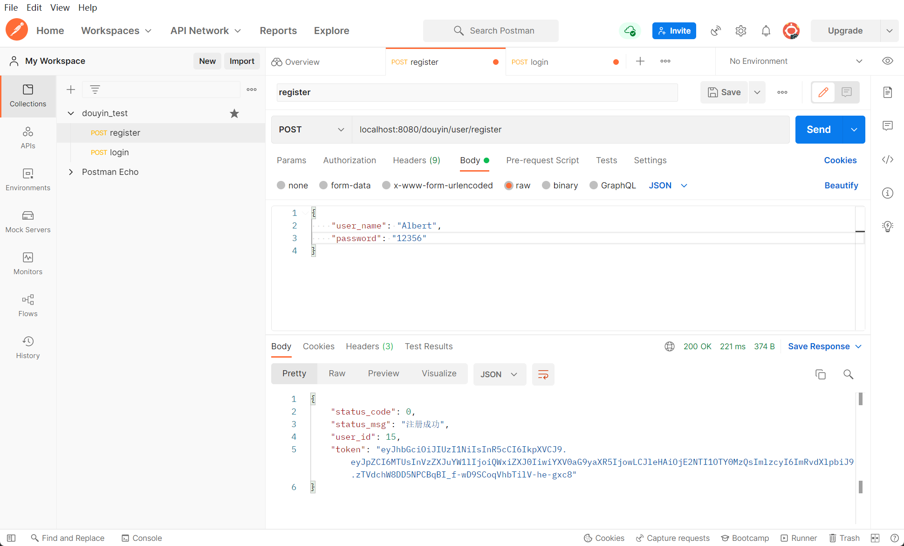

# ADDD_DOUYIN
This is a project for a group. The goal is for the champion.
这是一个团队工程。

**实现的一个mini版抖音服务端**

## 1.基础接口
   1. - [x]  视频流接口   //TODO 
   2. - [x]  用户注册
   3. - [x]  用户登录      
   4. - [x]  用户信息   
   5. - [x]  投稿接口
   6. - [x]  发布接口

## 2.扩展接口 - I
   1. - [x]  赞操作
   1. - [x]  点赞列表
   2. - [x]  评论操作
   3. - [x]  评论列表
   
## 2.扩展接口 - II
   1. - [x]  关注操作
   1. - [x]  关注列表
   2. - [x]  粉丝列表


## 项目结构

```shell
douyin/
├── conf
├── controller
├── log
├── middleware
├── model
├── routes
├── serializer
├── log
├── service
└── util
```

- conf : 用于存储配置文件
- controller : 用于处理请求JSON格式返回
- log : 用于存储日志文件
- middleware : 自定义的中间件
- model : gorm使用的数据库模型
- routes : 路由转发
- serializer：定义序列化json的结构体
- log：存放日志文件
- service : 具体的功能处理逻辑
- util：工具类


## 如何运行本项目

**1.下载第三方库**
```go
go mod tidy
```
**2.配置数据库**
1. 使用COS进行短视频存储，申请COS资源，在配置中填写对应bucket,id,key
2. 项目已经使用gorm2且开启了**数据库自动迁移模式**，仅需在conf/config.ini文件中配置相关参数，建立douyin数据库，启动服务器即可

**3.运行**
```go
go run main.go
```
运行项目生成数据表后，请运行以下SQL语句使得Gorm大小写敏感
```SQL
ALTER TABLE user MODIFY COLUMN name VARCHAR(50) BINARY CHARACTER SET utf8 COLLATE utf8_bin DEFAULT NULL;
```
**4.测试**
1. 可以使用**postman**对接口进行测试

1. 也可使用客户端测试


## 一些优化点
1. - [x] 使用bloomfilter判断重复用户名，减少数据库查询次数 


**后续的想法**
1. - [ ] 退出登录实现(前置条件：用户的Token存入Redis中)  
用户重新登录以后系统应该把这个用户之前签发的token都清除掉。如下设计：
redis的key可以是用户的id加上token，如key:"wfwjej24149uwehi3i#1"，（符号#前为token，符号#后为id）这样就可以通过token找id，也可以通过id找到token。
当用户重新登录的时候，肯定可以获取到用户的id，然后通过id在Redis中找到旧的token数据，将它们清除，或者更新版本号或者时间戳。
2. - [ ] 踩评论(抖音新增功能)
3. - [ ] 测试方法编写
4. - [ ] 每日排行榜,定时任务
5. - [ ] 日志写入本地log文件(实现logger中间件)
6. - [ ] 登录接口防刷  获取请求用户的IP,在Redis中维护一个黑名单窗口
7. - [ ] 缓存  一切涉及查询重要数据的地方都可以进行缓存，空间换时间 拉满
8. - [ ] 使用bloomFilter为用户的推荐Feed流去重,避免呈现给用户的视频是已经推送过的。
推送Feed流时通过布隆过滤器判断，推送内容是否已经存在，如果存在则不推送，如果不存在则推送；bloomFilter可以准确过滤用户已经看过的内容。对于没有看过的新内容，可能由于误判率过滤掉极小的一部分，这样就可以保证推荐给用户的都是无重复的。
7. - [ ] 针对游客与登录用户Feeds流的推送。对于游客，我们可以推送给他们点赞多或者排行榜靠前的视频，一次构造出30条，呈给用户。对于已经登录的用户，又细分为下面第8的情况👇
8. - [ ] 登录用户关注不同粉丝量的用户时Feeds流方式。假设在我们的实践中存在一个值为FansCount，当用户粉丝数大于等于FansCount时，我们定义该用户为明星用户，小于FansCount时该用户为普通用户。因此有了如下推送规则：当该用户关注的普通用户发抖音时，系统从数据库中拉取普通用户对应的抖音视频即可(拉模式)。当该用户关注的明星用户发抖音时（明星用户可能有几百万，几千万，甚至上亿的粉丝量），为了防止在瞬间给明星用户的粉丝推送视频产生的大量查询拖垮数据库。因此有了针对明星用户的规则：当明星用户发抖音时，我们把明星用户的视频写入到他/她的粉丝Feeds流中，而不是让他/她的粉丝来请求他/她发的抖音(推模式)。


